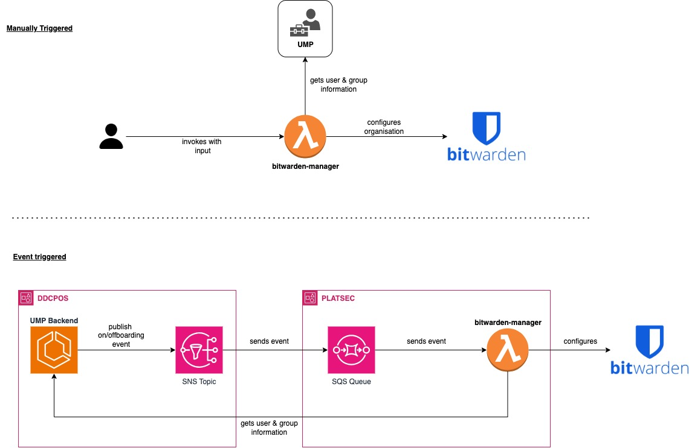

# Reference Architecture

<!--lint disable no-missing-blank-lines definition-case-->

<!--toc:start-->

* [Reference Architecture](#reference-architecture)
  * [Bitwarden-UMP mapping](#bitwarden-ump-mapping)
  * [Supported Usecases](#supported-usecases)
  * [Edge Cases](#edge-cases)
  * [References](#references)

<!--toc:end-->

<!--lint enable no-missing-blank-lines definition-case-->

Bitwarden-manager tool manages MDTP users' access to MDTP Bitwarden organization. It is designed to
source user and group information from [UMP][1] (MDTP's User Management Platform). It is currently manually
triggered with input such as username of a user that exists in UMP. Further details on events can be
found [here](../README.md).

## Bitwarden-UMP mapping

Bitwarden-manager lambda is intended to integrate with UMP to automate onboarding and offboarding of users.
The table below describes a mapping of some entities in Bitwarden to MDTP's UMP system that are relevant
to the current state of automation

| Bitwarden        | UMP             | Notes                               |
|------------      |------           | -----                               |
| [User][2]        | User            |                                     |
| [Group][3]       | Team            |                                     |
| [Collection][2]  | N/A             | container for passwords and secrets |
| Group membership | Team membership | manages access to collections       |
| [Folder][2]      | N/A             | not a currently used feature        |
| [Vault Item][4]  | N/A             | e.g. login, secure note etc that is manually administered by users |

## Supported Usecases

More features are being added to bitwarden-manager with time. The following are tasks that are supported as
at 04/12/2023:

* Add a new user with user information sourced from UMP
* Create a new group with group information sourced from UMP
* Create a new collection with a name that corresponds to a (UMP-sourced) group name
* assign group membership to enable access to collections linked to a group
* remove a user
* update group membership

## Edge Cases

> **Note:** The term "custom" refers to arbitrary entity that does not exist in UMP but for convenience purposes needs
> to be created/managed for a team.

* manage custom group including sub-groups
* manage access to custom groups i.e the lambda does not support automatically associating a user to any custom groups
* manage custom collections
* manage access to custom collections using group membership

## References

* [UMP Backend][1]
* [Bitwarden Core Entities][2]
* [Bitwarden Admin Console entities][3]

<!--reference-links:start-->

[1]: https://github.com/hmrc/user_management_backend/tree/main/user_management_backend "UMP Backend"

[2]: https://github.com/bitwarden/server/tree/master/src/Core/Entities "Bitwarden Core Entities"

[3]: https://github.com/bitwarden/server/tree/master/src/Core/AdminConsole/Entities "Bitwarden Admin Console entities"

[4]: https://github.com/bitwarden/server/blob/master/src/Core/Vault/Entities/Cipher.cs "Cipher"

<!--reference-links:end-->
